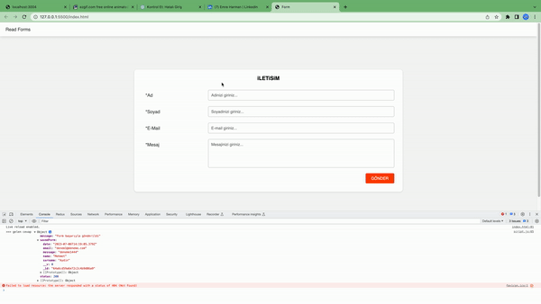

# Project Title

-js form validation-

## Acknowledgements

 - [Mehmet Can Seyhan (@isvec_krali)](https://twitter.com/isvec_kraIi)
 - [Furkan Evin](https://www.linkedin.com/in/furkan-evin/)
 - [Emre Harman](https://www.linkedin.com/in/emre-harman-2671481a6/)
 

## Yapilacaklar Detay

1- Form olustur

2- formu API'ye veri  gönder

3- Form listesini API'den cek ve ekrana bas
## Authors

- [@Mehmet1414](https://www.linkedin.com/in/mehmet1414/)

## Demo

</img>